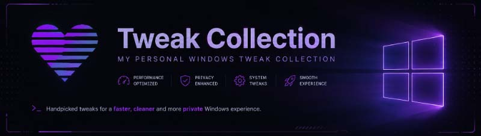

# Tweak Collection

### Windows tweaks that state their mechanism, their cost, and how to undo them.

 

**20** tweaks that survived · **40+** that did not · **0** that cannot be undone

 

This started as a text file of notes and a few batch scripts assembled from forum
posts. Read properly, most of what was in them was wrong — values the kernel
ignores, commands removed from Windows a decade ago, and one block that *enabled*
the latency features its own comment claimed to disable.

It was rebuilt from scratch, with the reasoning written down for every entry.

|  |  |
| :-- | :-- |
| ⚙️ | **Mechanism first.** Every tweak says what it changes and what it costs. |
| ↩️ | **Nothing is one-way.** State is captured before it is touched, and put back exactly. |
| 🔬 | **Checked, not copied.** Claims are verified against the binary that reads them. |
| 🗑️ | **The rejects are documented too.** Forty-plus of them, grouped by subsystem. |

 

### **[📖 Everything is in the docs →](https://slix1337x.github.io/Tweak-Collection/)**

[Tweaks](https://slix1337x.github.io/Tweak-Collection/tweaks/latency/) ·
[Debunked & rejected](https://slix1337x.github.io/Tweak-Collection/reference/debunked/) ·
[How a tweak earns its place](https://slix1337x.github.io/Tweak-Collection/start/method/) ·
[Undoing a tweak](https://slix1337x.github.io/Tweak-Collection/reference/undoing-a-tweak/)

---

## Disclaimer

These settings change how Windows schedules work, manages power and handles the
network, and some of them are trades rather than upgrades. What helps on one machine
does nothing on another.

Apply one category at a time, reboot in between, and
[measure](https://slix1337x.github.io/Tweak-Collection/guides/measuring-before-you-tweak/),
otherwise there is no telling a real improvement from a placebo. The script tries to
create a restore point first, but what you run on your machine is your
responsibility.

No warranty. See [LICENSE](LICENSE).

## Contributing

Corrections are welcome, especially to the [debunked
list](https://slix1337x.github.io/Tweak-Collection/reference/debunked/).

To suggest a tweak, answer the four questions from [how a tweak earns its
place](https://slix1337x.github.io/Tweak-Collection/start/method/): what mechanism it
changes, whether that is still true on current Windows, what it costs, and how it is
undone.

> "It feels smoother" is not evidence. A before/after frame-time capture or a
> LatencyMon trace is.
