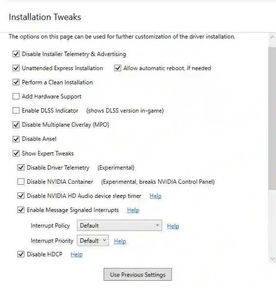
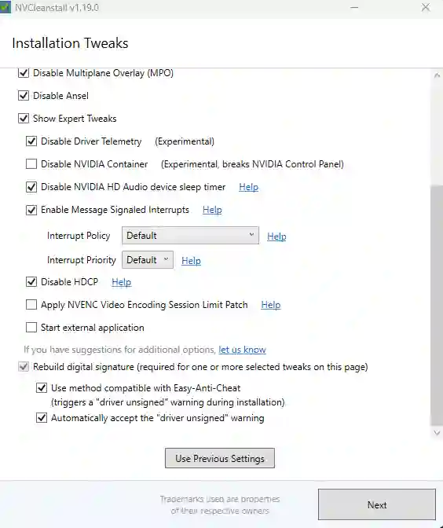

The highest-impact thing on this whole site is not a registry value. It is
installing a driver that does not drag half of GeForce Experience along with it.

## Tools

| Tool | What it is for |
| --- | --- |
| [DDU (Display Driver Uninstaller)](https://www.wagnardsoft.com/) | Completely removes an existing driver, including leftovers a normal uninstall misses. |
| [NVCleanstall](https://www.techpowerup.com/download/techpowerup-nvcleanstall/) | Repackages an official NVIDIA driver with only the components you choose. |

Both are free. Get them from the links above rather than a mirror. Do not ship
`NVCleanstall.exe` alongside a repo: committing an executable to git is a bad idea,
and a committed copy goes stale within months.

## When to use DDU

You do not need DDU for a routine driver update. NVIDIA's installer with
**Perform a clean installation** ticked handles that fine.

It is worth using when:

- You are switching between NVIDIA and AMD.
- You are rolling back several driver branches.
- You are chasing a specific driver-related fault: crashes, black screens, a
  display that will not wake, corrupt textures.

Run it from Safe Mode; DDU will offer to reboot into it for you. Disconnect from the
network first, or Windows Update will helpfully reinstall a driver before you can
install the one you want.

## NVCleanstall options

This is the **Installation Tweaks** page in NVCleanstall v1.19.0, with the
recommended configuration. It scrolls, so here is the top half:



…and the bottom half:



Option by option:

| Option | Setting | Why |
| --- | --- | --- |
| **Disable Installer Telemetry & Advertising** | ✅ | Stops the installer itself phoning home and pushing promos. Nothing depends on it. |
| **Unattended Express Installation** | ✅ | No prompts during install. |
| **Allow automatic reboot, if needed** | ✅ | Driver installs want a reboot; let it. |
| **Perform a Clean Installation** | ✅ | Wipes existing driver settings first. Equivalent to the NVIDIA installer's own clean install option. |
| **Add Hardware Support** | ⬜ | Only needed if you are installing this driver package on a different GPU than the one detected. |
| **Enable DLSS Indicator** | ⬜ | Debug overlay showing DLSS version in-game. Useful for testing, noise otherwise. |
| **Disable Multiplane Overlay (MPO)** | ✅ | MPO is a Windows compositor feature with a long history of flickering, black flashes and stutter on multi-monitor and mixed-refresh-rate setups. Disabling it is the standard fix. |
| **Disable Ansel** | ✅ | In-game screenshot tool. Injects into games. If you do not use it, it is pure overhead. |
| **Show Expert Tweaks** | ✅ | Reveals the rest of this list. |
| **Disable Driver Telemetry** | ✅ | Removes the telemetry components rather than disabling them afterwards. Marked experimental by NVCleanstall; has been stable in practice. |
| **Disable NVIDIA Container** | ⬜ | **Leave this off.** It breaks the NVIDIA Control Panel, which you need for per-application power management and V-Sync settings. |
| **Disable NVIDIA HD Audio device sleep timer** | ✅ | Stops the GPU's HDMI/DP audio output sleeping. Fixes the cut-off first half-second of audio when sound starts after a pause. |
| **Enable Message Signaled Interrupts** | ✅ | Same thing as [`nvidia.msi-mode`](../../tweaks/nvidia/#nvidia.msi-mode). Doing it here means it survives the install. |
| **Interrupt Policy / Priority** | Default | Leave both. Raising interrupt priority has no reproducible benefit and a real history of instability. |
| **Disable HDCP** | ⬜ | **Leave this off**, despite the screenshot. See below. |
| **Apply NVENC Video Encoding Session Limit Patch** | ⬜ | Lifts NVIDIA's limit on concurrent NVENC encode sessions. Only relevant if you are running several simultaneous streams. |
| **Start external application** | ⬜ | Runs something of your choosing after the install. Not needed. |
| **Rebuild digital signature** | ✅ (forced) | Required once any tweak modifies the package. Enabled automatically. |
| **Use method compatible with Easy-Anti-Cheat** | ✅ | Signs the repacked driver in a way EAC accepts. Without it, EAC-protected games can refuse to launch on a modified driver. The trade is a "driver unsigned" warning during installation. |
| **Automatically accept the "driver unsigned" warning** | ✅ | Clicks through the warning the option above causes, so the unattended install stays unattended. |

:::note[The anti-cheat option is the one worth understanding]
Any tweak on this page changes the driver package, which invalidates NVIDIA's
signature, so NVCleanstall re-signs it. Easy Anti-Cheat checks that signature.

The EAC-compatible method keeps those games working, at the cost of Windows showing
a "driver unsigned" prompt mid-install — which is expected here, and is why the next
option exists to accept it automatically. If you play anything on EAC, tick both.
:::

:::caution[Do not disable HDCP]
The screenshot above has **Disable HDCP** ticked, and many registry tweak scripts do
the same thing. It is a mistake.

Disabling HDCP gains you nothing in performance. What it does is break the copy
protection handshake on your display output, so Netflix, Disney+, Amazon Prime Video
and other DRM-protected streams either refuse to play or drop to 480p in a browser.

The reason it appears in tweak guides at all is a theory that the HDCP handshake
adds display latency. There is no measurement supporting that.
:::

## Multiplane Overlay, in more detail

MPO lets the GPU composite multiple display planes in hardware instead of having
the desktop window manager do it. In principle it saves power and a little
latency. In practice, on multi-monitor systems and especially with mixed refresh
rates or mixed HDR states, it has produced flickering, brief black screens on the
secondary display, and stutter in windowed games — for years, across driver
branches.

If you have a single monitor and no symptoms, leaving MPO on is fine. On a
multi-monitor setup, disabling it is the most reliable fix for a second monitor that
flickers during ordinary desktop use.

It can also be disabled after the fact:

```text
HKLM\SOFTWARE\Microsoft\Windows\Dwm
  OverlayTestMode = 5   (REG_DWORD)
```

Reboot afterwards. Delete the value to re-enable MPO.

## About driver versions

The screenshot on this page was once filed under the name
`537.58 oder 546.33.png`, because those were the two driver branches that felt best
in CS2 at the time.

**That was three years ago, and the name has been dropped.** Driver rankings age out
within months: engines update, drivers pick up optimisations and regressions, and the
branch that was best back then is not being compared against anything current. It
was exactly the kind of note that is worse than no note, because it invites trust it
has not earned.

The rules that do not age:

- Newer is usually better for a game that is actively being patched, because
  NVIDIA ships game-specific optimisations in Game Ready drivers.
- If a new driver makes a specific game worse, roll back one branch and check
  whether it is a known regression before assuming it is your machine.
- Studio drivers are not slower for gaming. They are the same code on a slower
  release cadence, validated longer. If stability matters more to you than day-one
  support for a new title, they are a reasonable default.
- Never chase a driver version because a forum post from an unspecified date
  recommends it. Or because a screenshot in someone's repo does — this one included.
